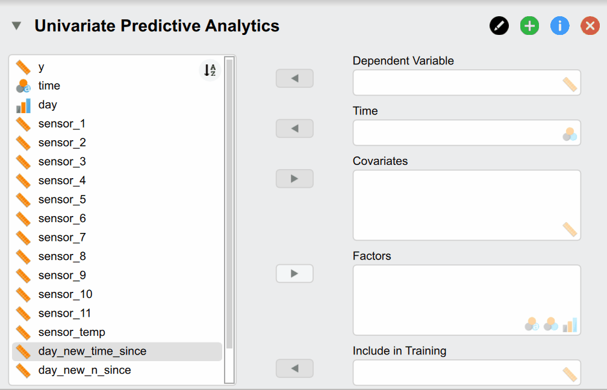
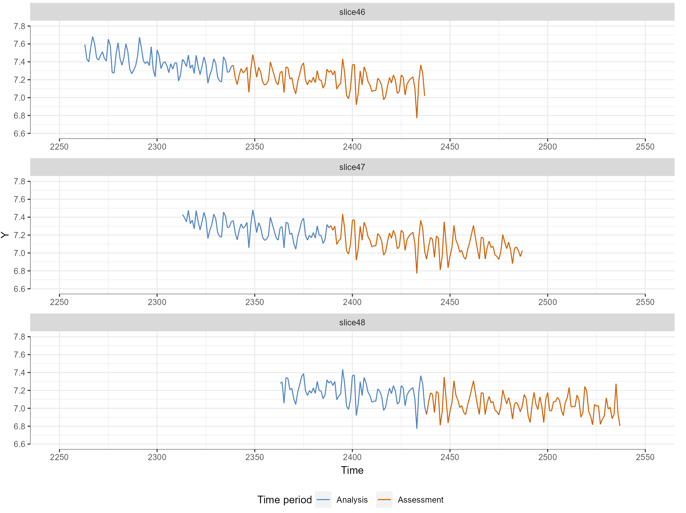

The full functionality of the module is quite extensive but can mainly be divided into 3
steps:

1.  Determining the control bounds
2.  Selection and validation of candidate models
3.  Selecting the right model for future prediction

The basic idea is to first set the control limits, select various possible models and test
their predictive accuracy on past data and finally use these results to select the final
model that we want to use to predict the future. By using past performance as a proxy for
future performance we should be able to select a better predicting model.

We will demonstrate the functionality on a simulated data set that is supposed to
represent a real world production process where our goal is to make sure that our process
stays in control and intervene earlier if the process is predicting that it will go out of
control in the future. Additionally, we also have some measures from arbitrary sensors at
the start of the cycle that are slightly related to the process. Since we want to predict
into the future, we cannot use the measures at the end of the production cycle where each
product is measured for its size.

The values of the process are primarily influenced by heat which depends on whether the
machine is turned over over night or when it is turned off for maintenance. It runs
everyday from 08:00 until 19:00 and produces 60 pieces per minute.

Since one production cycle for one piece takes approximately 100 data points from start to
finish, our goal is to predict 100 data points into the future. That way we could
intervene if the results of the next cycle were predicted to go out of control. Because if
we would only notice at the end of the production cycle we would need to discard all the
data from the previous cycle.

## Determining the control bounds

### Selecting necessary variables

As a first step we need to load the data into JASP which is shown in the following image:

But what do of these different options mean? Our **Dependent Variable *y*** is the
continuous production process we want to monitor and predict over time. The **Time**
variable ***time*** contains the time stamps that must be supplied. Supplying
**Covariates** and **Factors** is optional since they are not necessary for the classical
time series models as these only rely on time. In our case we do have them available and
can include them to improve predictive accuracy. We use the sensor readings from the
beginning of the time series as well as temperature reading. Additionally, we have a two
variables called ***day_new_time_since*** and ***day_new_n_since*** that indicate how many
pieces have been produced since and how much time has passed since the start of that day.
They are useful because the time the machine has been on directly related to its
temperature. Lastly, the **Include in Training** variable indicates whether a time point
should be used for training and verifying the model (set to 1) or whether it should be
used to predict the future to make decisions. While the observations of the dependent
variable are of course not available for these data points as we want to predict them, it
is needed to supply covariates and factors if we included them to build the model.

### Control plot and control limits

After the variables have been supplied, we automatically get a basic control plot in the
result section of JASP:

{width="659"}

The red dashed lines indicate the control bounds that we don't want to cross. As a default
the limit is set in such a way that all the data that is more than 2 standard deviations
away from the mean is flagged as out-of-control.

From mere visual inspection alone we can already see two things: There seems to be a
pattern in the process where it abruptly starts high and slowly declines towards the
middle. (wording). As mentioned previously, this directly relates to the effect of the
temperature: Since we measure the process over several days, the machine cools down at
night when turned off. A lower temperature causes the produced pieces to be larger. While
the machine is on continuously, the temperature rises to a certain degree until the size
of each piece is somewhat stable.

As a second observation the process seems to go out-of-control at the end of the time
series quite rapidly. The hypothetical explanation is that a part of the machine broke
inside the machine and subsequently heats up the machine much more drastically which
explains the process going out-of-control. Since it is undesirable to let the process
go-out-of control, we will test in this tutorial whether we can predict whether the
process goes out-of-control!

But let us first adjust the control limits. In production processes we often know how
large/small a produced object must be so be don't have to set the control bounds based on
data. For our example we will shift the control limits a bit up as only the last part of
the time series clearly goes out-of-control. We can do this under the *Time Series
Descriptives* section:

{width="455"}

Under the *Error Bound Selection* option we can select *Manual Bounds* and then manually
input the upper/lower limit of 8.2/7.15 which changes the plot into the following:

{width="514"}

Now we have set our control limits and the next step is to select the .

## Selection and validation of candidate models

### Choosing Evaluation plan

As mentioned previously, we want to choose the model predicts the future the best. One
method for this is cross validation where the exisiting data is split into **training**
and **test** data set. The training set is used to train the statistical model which then
make predictions about the test set that are compared to the real observation.

As the goal is to evaluate the predictive performance on unseen future observation, normal
cross validation that randomly selects training and test data is not appropriate. Instead,
the data is split in such a way that the training data is always temporally before the
test data. In our example we want to train the models on some amount of past data and then
use thenext 100 data points as test data as this constitutes one production cycle.
Afterwards we shift the training window ahead by a certain amount of data points, retrain
our models and then predict the next 100 data points. This is called rolling window cross
validation or historical historical forecast evaluation.

The settings for this procedure can be found under the "Forecast Evaluation" section in
JASP (see image). We will evaluate whether we can predict that the process goes
out-of-control in the last section.

{style="float: right" width="246"}

The *Training window* option refers to how many past data points our model is trained on.
Since we experience an underlying shift during the last day of the process and it goes out
of control, we will only train the models on the past 75 data points. In practice it might
be unknownon how much data each model should be trained on and different options should be
considered. If the underlying data generating process stays constant over time, the models
are ideally trained on all of the past - his can be achieved by checking the option for
*Cumulative Training.* If the process changes over time or predictive performance
deteriorates the underlying process might warrant shorter training windows.

The *Prediction window* option determines how many data points should be predicted into
the future. This is ideally chosen in such a way that it corresponds to the prediction
horizon one is interested in predicting (as different models might perform better in short
and other in long-term forecasts). In our example this corresponds to a prediction horizon
of 100 as this represents one full cycle.

The next option called *Skip between training slices* indicates how many data points are
shifted ahead for each prediction slice.

The *Maximum nr. of slices option* determines how many folds are created. Increasing this
number leads to less prediction slices or folds that are computed but might increase
computation time. Especially if computational time is scarce since we want to make a
timely prediction about the future, we might want to select a smaller number. In our case
we selected 6 as we want to only predict the last part of the process where the data goes
out-of-control.

When we check the *Show evaluation* option we can also see the evaluation plan visualized
to check which data the model will evaluate (see Figure 6). Here we see that the blue
colored data is the training period that the models are trained on whereas the red period
will be predicted and compared with the actual observations.

### Selecting candidate models

Now that we have a plan to evaluate the data, we can select the models that we want to use
to predict the future. We can find the option for selecting different models under the
Forecast Evaluation section under Model Choice. On the left side of the selection option,
all available models are displayed while the right side indicates the models we have
chosen for prediction.

A little explanation on the naming convention for all models: The model family is
indicated as the first part of the model name before the hyphen "-" and the text
afterwards indicates the model specification. For more a more in-depth explanation of all
models and further resources on them see the [Background](background.html#models) section.

{width="455"}

For example in our selected models, the **prophet** model is a Bayesian time series model
that automatically models appropriate seasonality via fourier orders, trend and change
points. As it is a time series model, it predicts future observation of our dependent
variable based on past values. If we would want to add covariates, we would select the
**prohpet - regression** model. Our second model denoted as **bart - regression** is a
Bayesian Additive Regression Tree model. It combines multiple decision trees into a large
ensemble model and is able to model high-dimensional non-linear relationships. As it is
not a time series by default, we need to supply it at least some covariates which we do in
our selection in this example. Additionally, it is also possible to supply it with our
lagged dependent variable. If we enable this option in the **Feature Engineering**
section, internally a new column is created which contains our dependent variable but at a
previous time point. That way even models that are not time series models can model the
relationship of a variable with itself over time. When the model then predicts future data
points in our test set, the predicted value for time point **t** is then iteratively used
as a input covariate for the prediction of time point **t+1.** Note that this takes a long
time for the BART model as the model generally takes a long time to compute.

After we have selected which models we would like to use for prediction, the models are
being trained and evaluated based on the evaluation plan we specified earlier. After the
computations are finished, we get a table with the corresponding evaluation metrics and
are also able to plot our predictions.

### Choosing an appropriate evaluation metrics

One can evaluate the prediction accuracy of our models by computing so called evaluation
or forecast metrics that measure how well our models predict the future by comparing the
actual observations of the test set with the predictions. The JASP module offers both
probabilistic and point-based prediction metrics: Instead of relying on the point or mean
prediction of a model, probabilistic forecast metrics compute how much the observed value
differs from the whole predictive distribution. That way we are able to take into account
the uncertainty that is associated with our predictive distribution. Ideally our
distribution is very sharp as this indicates that we are very certain in our prediction.

For the current example we focus on the mean absolute error (MAE), the Continuous Ranked
Probability Score (CRPS) and the R-squared value. As the name suggests the MAE is
calculated by calculating how each observations differs from the forecast in absolute
terms (i.e. removing the minus of negative numbers) and averaging it across all predicted
observations. The CRPS on the other generalizes the MAE as it computes it for the whole
predictive distribution instead of a single forecast for each observation. The R-squared
value on the other hand computes how much variance is explained by the forecast. The other
forecast metrics are explained in detail [here](general_documentation.html#forecast-evaluation-metric-table).

Now let's look at the table with forecast evaluation metrics
